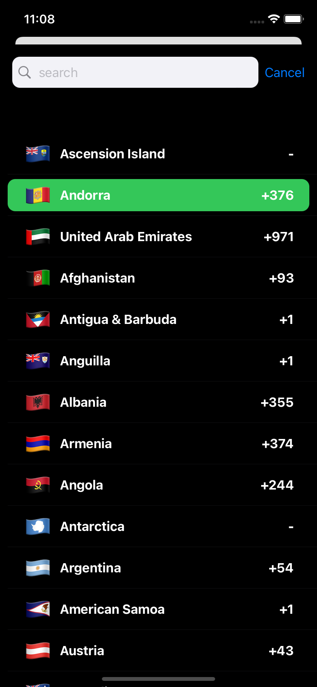

# Custom CountryPicker SwiftUI

#### Simple and powerful ContryPicker. You can use it for your own porject that requires quick customization.

## Screenshot 

## Requirements

- iOS 12+
- Xcode 12+
- Swift 5.3+

## Installation

Currently CountryPicker is only avaliable via SPM. You can also add manually to your project.

### SPM

If you have already Swift package set up, add CountryPicker as a dependency to your dependencies in your `Package.swift` file.

## Usage

### SwiftUI

To present `CountryPickerViewController` on SwiftUI, you need to create a `CountryPicker` representable.

#### Customization

You can easly customize the picker with editing properties.
